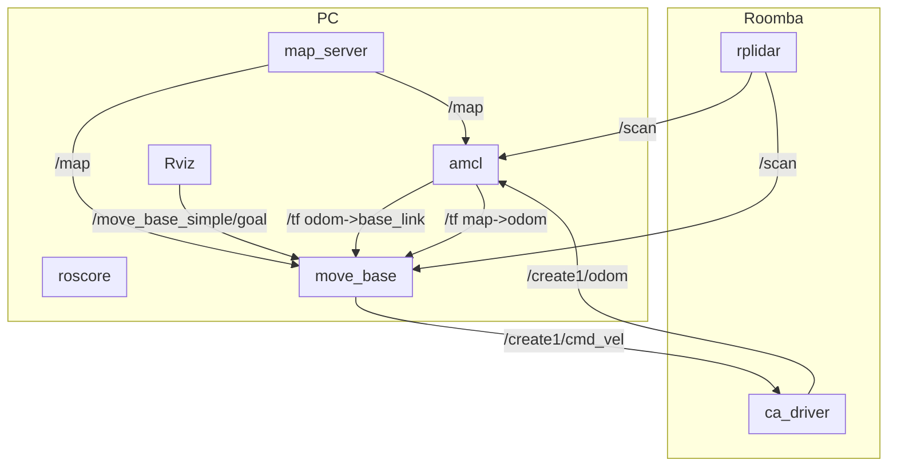

# Roombaの実機環境でのNavigaton

* 参考ページ
TBD

* 使用ドライバ
    * [RoboticaUtnFrba/libcreate](https://github.com/RoboticaUtnFrba/libcreate)
    * [RoboticaUtnFrba/create_autonomy](https://github.com/RoboticaUtnFrba/create_autonomy)

* 構成図

