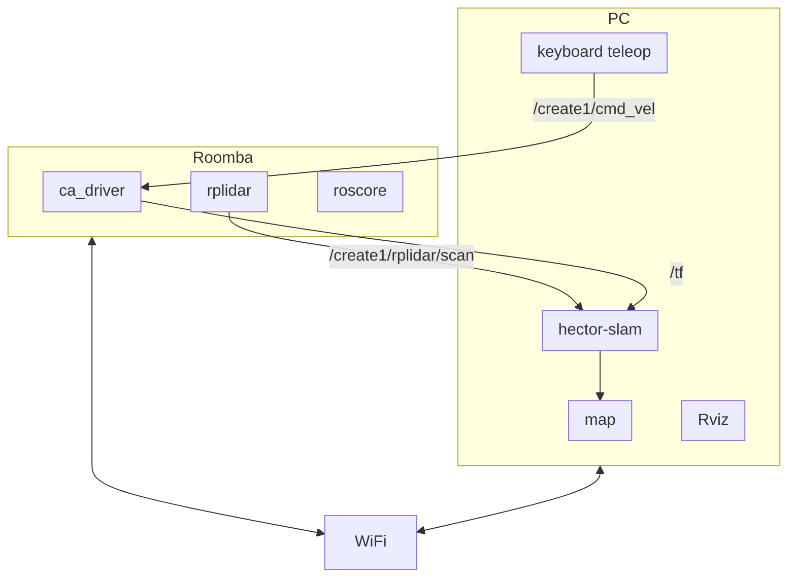

# Roombaの実機環境でのhector-SLAMとNavigation

* 使用ドライバ
    * https://github.com/kanpapa/create_autonomy/tree/kanpapa-patch-1
* テスト環境のIPアドレスは以下のようになっています。
    * Ubuntu PC 192.168.0.34
    * Raspberry Pi 192.168.0.63
* 参考サイト
    * [hector_slamと2D Navigationを組み合わせてRoombaを自律移動させる](https://daikimaekawa.github.io/ros/2014/04/20/Navigation2d)

## 構成図

* SLAM



* Navigation

```
TBD
```

## STEP1. Roomba実機環境(Raspberry Pi)の準備

1. Raspberry Piにモバイルバッテリをつないで起動する。
1. Raspberry PiのUSBにRoombaとLiDARを接続する。
1. Ubuntu PCにログインし、以下のコマンドでRaspberry PiのIPを探す。
    ```
    nmap -sP 192.168.100.0/24
    ```
1. Ubuntu PCからRaspberry Piにログイン
    ```
    ssh ubuntu@192.168.0.63
    ```
1. Raspberry Piの~/.bashrcに環境変数の設定をする。
    ```
    export ROS_MASTER_URI=http://192.168.0.63:11311
    export ROS_HOSTNAME=192.168.0.63
    ```
1. 環境変数を設定する。
    ```
    source ~/.bashrc
    ```
1. ca_driverのconfigファイルを確認する    
    ~/catkin_ws/src/create_autonomy/ca_driver/config/default.yamlのpublish_tf: がtrueであることを確認する。
    ```
    # Whether to publish the transform between odom_frame and base_frame
    #publish_tf: false
    publish_tf: true
    ```
    ※この設定がfalseだと、create1/odomとcreate1/base_footprintをつなぐtfが配信されない。
1. ca_bringupを起動する。
    ```
    roslaunch ca_bringup minimal2.launch imu:=false
    ```
    ※IMUを使わない場合はimu:=flaseを追加。使う場合は指定しなくてもよい。

## STEP2. Ubuntu PCとRoombaの接続設定

1. Ubuntu PCの~/.bashrcに環境変数の設定をする。ROS_MASTERはRaspberry Piになる。
    ```
    export ROS_MASTER_URI=http://192.168.0.63:11311
    export ROS_HOSTNAME=192.168.0.34
    ```
1. 環境変数を設定する。
    ```
    source ~/.bashrc
    ```
1. ROSコマンドを入力してRoombaのトピックが見えるか確認する。
    ```
    rostopic list
    ```

## STEP3. hector-SLAMで地図をつくる

1. hector-slamを起動する
    ```
    roslaunch ca_hector default_mapping2.launch
    ```
1. Rvizを起動する。
    ```
    roslaunch ca_tools rviz.launch
    ```
1. Ubuntu PCでキーボードでルンバを動かして、地図情報を取得する。
    ```
    roslaunch ca_tools keyboard_teleop.launch
    ```
1. リアルタイムで地図ができあがったら、Ubuntu PCで新しいターミナルを起動して以下を入力する
    ```
    rosrun map_server map_saver -f mymap
    ```
1. カレントディレクトリに mymap.pgm と mymap.yaml というファイル名で地図情報が保存される。

## STEP4. Navigationをする

1. Ubuntu PCで起動しているROSノードを停止する。
1. Navigationを起動する。
    ```
    roslaunch ca_move_base navigate2.launch localization:=hector_mapping

    ```
1. Rvizを起動する。
    ```
    roslaunch ca_tools rviz.launch
    ```
1. Rvizの2D Nav Goalをクリックして目的地点と方向を指定する。
