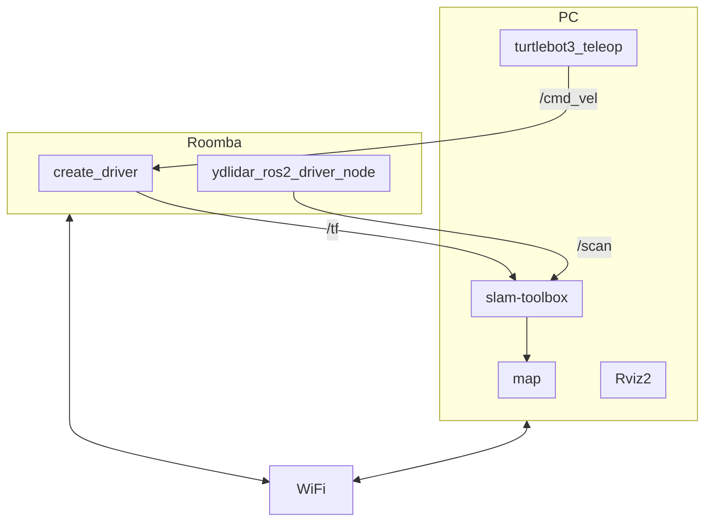

# Roomba実機をROS2 foxyで動かす環境のセットアップ

## 構成図

* SLAM



* Nav2

    TBD

## リモートPCのセットアップ

1. Ubuntu 20.04 LTS Desktopのインストール

    通常通りインストール。日本語を使うのであれば[Ubuntu Desktop 20.04 LTS 日本語 Remix](https://www.ubuntulinux.jp/japanese)がお勧め。

1. ROS2 foxyのインストール

    [ROS2 Foxyの公式インストールガイド](https://docs.ros.org/en/foxy/Installation/Ubuntu-Install-Debians.html#install-ros-2-packages)に従ってインストールしてください。  
    Desktop Installを行うことで、ROS本体とRViz等のツール、デモプログラム、チュートリアルがインストールされます。
    ```
    $ sudo apt install ros-foxy-desktop
    $ source /opt/ros/foxy/setup.bash
    ```

1. turtlebot3のパッケージインストール
    ```
    $ sudo apt install ros-foxy-turtlebot3-msgs
    $ sudo apt install ros-foxy-turtlebot3
    ```

1. ~/.bashrcの設定

    毎回入力するのは大変なので、~/.bashrcを設定しておきます。ドメインは100としました。
    ```
    $ echo 'source /opt/ros/foxy/setup.bash' >> ~/.bashrc
    $ echo 'export ROS_DOMAIN_ID=100' >> ~/.bashrc
    $ source ~/.bashrc
    $ env | fgrep ROS
    ```

1. VMwareの場合は以下の環境変数を~/.bashrcに設定します。(RvizやGazeboがOpenGL2系のため。)
    ```
    export SVGA_VGPU10=0
    ```

## Raspberry Piの初期設定

### Ubuntu 20.04 LTS Serverのインストール

1. Raspberry pi imager で[Ubuntu 20.04 LTS Raspberry Pi Generic (64-bit ARM) preinstalled server image](https://cdimage.ubuntu.com/releases/20.04/release/)のSDカードを作成する。
1. Raspberry pi にHDMI、キーボードをつけてSDカードをセットして電源を投入する。
1. 立ち上がったらログインする。英語キーボード配列なので注意。
    - 初期アカウントは　ubuntu/ubuntu
    - 初回ログイン時にパスワード変更が入る。
1. WiFiのセットアップとsshdのセットアップ
    ```
    $ cd /etc/netplan/
    $ sudo vi 99-custom.yaml
    $ cat 99-custom.yaml
    network:
      version: 2
      wifis:
        wlan0:
          dhcp4: true
          access-points:
            SSID:
              password: "PASSWORD"
    $ sudo netplan apply
    $ sudo apt install openssh-server
    ```
1. 日本語キーボード対応
    ```
    $ sudo dpkg-reconfigure keyboard-configuration
    ```
    コンソール上にウィザードが表示されるので、以下の順番で選択する
    ```
    Generic 105-key (Intl) PC
    Japanese
    Japanese
    The default for the keyboard layout
    No compose key
    No
    ```
1. IPアドレスを確認して控えておく。
    ```
    $ ip a
    ```

### ROS2 foxyのインストール

1. 別のPCからRaspberry PiのIPアドレスに対してsshで接続する。設定作業はこのリモートPCから行う。
    ```
    $ ssh ubuntu@192.168.100.45
    ```
1. ROS2 foxyのインストール

    基本的にはこのサイト通りでインストールできます。必ずROS2 foxyの動作確認まで行ってください。

    https://docs.ros.org/en/foxy/Installation/Ubuntu-Install-Debians.html

    Desktop InstallとROS-Base Installの2種類がありますが、Desktop Installは各種ツールが揃っているのでこちらを推奨します。  
    慣れてきたらROS-Base Installでも良いかもしれない。

1. create_autonomyのインストール

    基本的にはREADME.mdのInstallの手順通りでインストールできます。

    https://github.com/AutonomyLab/create_robot/tree/foxy


    途中で以下のエラーがでた場合の対処方法
    ```
    Starting >>> create_description
    --- stderr: create_msgs
    CMake Error at CMakeLists.txt:2 (project):
      No CMAKE_CXX_COMPILER could be found.
    ```

    この場合は、g++をインストールすると解消されました。
    ```
    $ sudo apt install g++
    ```

1. ~/.bashrcの設定

    毎回入力するのは大変なので、~/.bashrcを設定しておきます。ドメインは100としました。
    ```
    $ echo 'source /opt/ros/foxy/setup.bash' >> ~/.bashrc
    $ echo 'source ~/create_ws/install/setup.bash' >> ~/.bashrc  
    $ echo 'export ROS_DOMAIN_ID=100' >> ~/.bashrc
    $ source ~/.bashrc
    $ env | fgrep ROS
    ```

### シリアルUSBの接続

1. Raspberry Pi 4とUSBシリアルを接続し、OSで認識されているか確認する。今回は/dev/ttyUSB0で認識したので、以下のように表示された。  
    ```
    $ ls -l /dev/ttyUSB*
    crw-rw---- 1 root dialout 188, 0 May 28 00:28 /dev/ttyUSB0
    ```

### udevの設定

シリアルUSBデバイスをどのユーザからも読み書きできるように設定する。（毎回chmodでの設定が不要になるように）

1. lsusbコマンドを入力する。
    ```
    $ lsusb
    ```
1. シリアルUSBデバイスのベンダーIDとプロダクトIDをメモする。今回のシリアルUSBはFT232を使用している。  
（実行例）
    ```
    $ lsusb
    Bus 002 Device 001: ID 1d6b:0003 Linux Foundation 3.0 root hub
    Bus 001 Device 005: ID 046d:c542 Logitech, Inc. 
    Bus 001 Device 004: ID 0403:6001 Future Technology Devices International, Ltd FT232 USB-Serial (UART) IC
    Bus 001 Device 003: ID 3938:1048  
    Bus 001 Device 002: ID 2109:3431 VIA Labs, Inc. Hub
    Bus 001 Device 001: ID 1d6b:0002 Linux Foundation 2.0 root hub
    ```

1. 以下のコマンドを実行する。
    ```
    $ sudo vi /etc/udev/rules.d/77-roomba.rules
    ```
1. 以下のように書き込む。
    ```
    KERNEL=="ttyUSB*", ATTRS{idVendor}=="ベンダーID", ATTRS{idProduct}=="プロダクトID", GROUP="dialout", MODE="0666", SYMLINK+="roomba"
    ```
    今回の設定例
    ```
    KERNEL=="ttyUSB*", ATTRS{idVendor}=="0403", ATTRS{idProduct}=="6001", GROUP="dialout", MODE="0666", SYMLINK+="roomba"
    ```
1. RoombaのUSBシリアルケーブルを一度抜き、再度差し込む。
1. udevの設定が行われ、パーミッションのotherがrwになっていることとroombaのシンボリックリンクができていることを確認する。  
    ```
    $ ls -l /dev/ttyUSB*
    crw-rw-rw- 1 root dialout 188, 0 Jul 31 03:19 /dev/ttyUSB0
    $ ls -l /dev/roomba
    lrwxrwxrwx 1 root root 7 Jul 31 03:19 /dev/roomba -> ttyUSB0
    ```
1. create_robotの設定ファイルを修正する。  
~/create_ws/src/create_robot/create_bringup/config/default.yamlのdev:が/dev/ttyUSB0となっているので、/dev/roombaに修正しておく。
    ```
    create_driver:
      ros__parameters:
        # The device path for the robot
        #dev: "/dev/ttyUSB0"
        dev: "/dev/roomba"
               :
    ```

## ルンバを動かすための準備

### Raspberry Piにログイン

1. Raspberry Piの電源をモバイルバッテリーに接続する。
1. Ubuntu PCからRaspberry Piにログインする。
    ```
    $ ssh ubuntu@192.168.100.63
    ```
    IPアドレスがわからない場合は以下のコマンドで目星を付ける。192.168.100.0/24のところはWiFiのネットワークに合わせてください。
    ```
    $ nmap -sP 192.168.100.0/24
    ```

### シリアルUSBの接続

1. Raspberry Pi 4とUSBシリアルを接続する。
1. シリアルUSBのデバイスが以下のように表示されることを確認する。  
    ```
    $ ls -l /dev/roomba
    lrwxrwxrwx 1 root root 7 Jul  3 14:57 /dev/roomba -> ttyUSB0
    $ ls -l /dev/ttyUSB0
    crw-rw-rw- 1 root dialout 188, 0 Jul  3 14:45 /dev/ttyUSB0
    ```

### Roombaのシリアルポートと接続する

1. RoombaのシリアルポートとUSBシリアルのシリアルポートを以下のように接続する
    ```
    FT232(5V)   Roomba
    GND ------- 6,7 GND
    CTS
    5V
    TXD ------- 3 RXD
    RXD ------- 4 TXD
    RTS
    ```
    ルンバのコネクタを上からみた図
    ```
                      (1) (2)
                       =====
    FT232 TXD <----(3) ===== (4)----> FT232 RXD

                    (5) (6) (7)
                         |
                        GND
    ```

## ルンバを動かす

### Raspberry Pi 4での操作

#### create_driverノードの起動

1. Roombaの電源を入れる
1. 別にターミナルを１つ立ち上げて、Raspberry Piにログインし、以下のコマンドを入力する。
    ```
    $ ros2 launch create_bringup create_2.launch
    ```
1. 以下のような画面になることを確認する。正常に接続できるとRoombaから音が鳴る。  
    ```
    $ ros2 launch create_bringup create_2.launch
    [INFO] [launch]: All log files can be found below /home/ubuntu/.ros/log/2022-06-25-06-46-02-115705-ubuntu-2665
    [INFO] [launch]: Default logging verbosity is set to INFO
    [INFO] [create_driver-1]: process started with pid [2668]
        :
    [create_driver-1] [INFO] [1656139562.967943352] [create_driver]: [CREATE] "CREATE_2" selected
    [create_driver-1] [INFO] [1656139564.121113068] [create_driver]: [CREATE] Connection established.
    [create_driver-1] [INFO] [1656139564.121519229] [create_driver]: [CREATE] Battery level 30.45 %
    [create_driver-1] [INFO] [1656139564.156253846] [create_driver]: [CREATE] Ready.
    ```

#### LiDARノードの起動

1. 新規にターミナルを立ち上げて、Raspberry PiにログインしてLiDARのドライバを起動する。
    - YDLiDAR X2の場合
        ```
        $ ros2 launch ydlidar_ros2_driver ydlidar_launch.py
        ```
    - SLAMTEC RPLIDAR A1の場合
        ```
        $ ros2 launch sllidar_ros2 sllidar_launch.py serial_port:=/dev/rplidar
        ```
1. 以下のような画面になることを確認する。LiDARが勢いよく回転を始めます。
    ```
    $ ros2 launch ydlidar_ros2_driver ydlidar_launch.py
    [INFO] [launch]: All log files can be found below /home/ubuntu/.ros/log/2022-07-18-23-32-16-832154-ubuntu-1369
    [INFO] [launch]: Default logging verbosity is set to INFO
        :
    [ydlidar_ros2_driver_node-1] YDLidar SDK initializing
    [ydlidar_ros2_driver_node-1] YDLidar SDK has been initialized
    [ydlidar_ros2_driver_node-1] [YDLIDAR]:SDK Version: 1.1.1
    [static_transform_publisher-2] [INFO] [1658187137.609758419] [static_tf_pub_laser]: Spinning until killed publishing transform from 'base_link' to 'laser_frame'
    [ydlidar_ros2_driver_node-1] LiDAR successfully connected
    [ydlidar_ros2_driver_node-1] [YDLIDAR]:Lidar running correctly ! The health status: good
    [ydlidar_ros2_driver_node-1] LiDAR init success, Elapsed time 640 ms
    [ydlidar_ros2_driver_node-1] [CYdLidar] Successed to start scan mode, Elapsed time 1065 ms
    [ydlidar_ros2_driver_node-1] [YDLIDAR] Calc Sample Rate: 3K
    [ydlidar_ros2_driver_node-1] [YDLIDAR] Fixed Size: 720
    [ydlidar_ros2_driver_node-1] [YDLIDAR] Sample Rate: 3K
    [ydlidar_ros2_driver_node-1] [YDLIDAR] Calc Sample Rate: 3K
    [ydlidar_ros2_driver_node-1] [YDLIDAR] Fixed Size: 720
    [ydlidar_ros2_driver_node-1] [YDLIDAR] Sample Rate: 3K
    [ydlidar_ros2_driver_node-1] [YDLIDAR]:Single Fixed Size: 250
    [ydlidar_ros2_driver_node-1] [YDLIDAR]:Sample Rate: 3K
    [ydlidar_ros2_driver_node-1] [YDLIDAR INFO] Single Channel Current Sampling Rate: 3K
    [ydlidar_ros2_driver_node-1] [YDLIDAR INFO] Now YDLIDAR is scanning ......
    ```

#### ルンバ単体での動作確認方法

1. 新規にターミナルを立ち上げて以下のコマンドを入力する。
    ```
    $ ros2 topic pub /cmd_vel geometry_msgs/Twist '{linear: {x: 0.1}, angular: {z: 0.3}}'
    ```
1. ルンバが少しずつ動き続けるのでCTRL-Cで中断する。


### リモートPCでの操作

1. セットアップしたリモートPCにログインする。
1. トピックが流れてきているか確認する。
    ```
    $ ros2 topic list 
    /battery/capacity
    /battery/charge
    /battery/charge_ratio
    /battery/charging_state
    /battery/current
    /battery/temperature
    /battery/voltage
    /bumper
    /check_led
    /clean_button
    /cliff
    /cmd_vel
    /day_button
    /debris_led
    /define_song
    /diagnostics
    /dock
    /dock_button
    /dock_led
    /hour_button
    /ir_omni
    /joint_states
    /main_brush_motor
    /minute_button
    /mode
    /odom
    /parameter_events
    /play_song
    /power_led
    /robot_description
    /rosout
    /scan
    /set_ascii
    /side_brush_motor
    /spot_button
    /spot_led
    /tf
    /tf_static
    /undock
    /vacuum_motor
    /wheeldrop
    /ydlidar_ros2_driver_node/transition_event
    $
    ```

1. ノードの確認

    ```
    $ ros2 node list 
    /create_driver
    /launch_ros_1369
    /robot_state_publisher
    /static_tf_pub_laser
    /ydlidar_ros2_driver_node
    $ 
    ```

1. サービスの確認

    ```
    $ ros2 service list 
    /create_driver/describe_parameters
    /create_driver/get_parameter_types
    /create_driver/get_parameters
    /create_driver/list_parameters
    /create_driver/set_parameters
    /create_driver/set_parameters_atomically
    /launch_ros_1369/describe_parameters
    /launch_ros_1369/get_parameter_types
    /launch_ros_1369/get_parameters
    /launch_ros_1369/list_parameters
    /launch_ros_1369/set_parameters
    /launch_ros_1369/set_parameters_atomically
    /robot_state_publisher/describe_parameters
    /robot_state_publisher/get_parameter_types
    /robot_state_publisher/get_parameters
    /robot_state_publisher/list_parameters
    /robot_state_publisher/set_parameters
    /robot_state_publisher/set_parameters_atomically
    /start_scan
    /static_tf_pub_laser/describe_parameters
    /static_tf_pub_laser/get_parameter_types
    /static_tf_pub_laser/get_parameters
    /static_tf_pub_laser/list_parameters
    /static_tf_pub_laser/set_parameters
    /static_tf_pub_laser/set_parameters_atomically
    /stop_scan
    /ydlidar_ros2_driver_node/change_state
    /ydlidar_ros2_driver_node/describe_parameters
    /ydlidar_ros2_driver_node/get_parameter_types
    /ydlidar_ros2_driver_node/get_parameters
    /ydlidar_ros2_driver_node/list_parameters
    /ydlidar_ros2_driver_node/set_parameters
    /ydlidar_ros2_driver_node/set_parameters_atomically
    $ 
    ```

#### Roombaをキーボードで操作

1. 以下のコマンドを入力する。細かい操作ができるturtlebot3用の操作パッケージを流用する。
    ```
    $ export TURTLEBOT3_MODEL=burger
    $ ros2 run turtlebot3_teleop teleop_keyboard
    ```

#### Rviz2での確認

1. Rviz2を起動する。
    ```
    $ rviz2
    ```
1. FileメニューのOpen Configで、[ros2_roomba_slam.rviz](/rviz2/ros2_roomba_slam.rviz)を指定します。
1. Global OptionsのFixed Frameをbase_frameにして、ルンバの位置を示すTFデータとLiDARのスキャンデータが見えれば問題ありません。

- configファイルでは以下の点を設定しています。
    - 左側のDisplaysのメニューでAddをクリックする。
    - By display typeからLaserScanを選んでOKをクリックし、追加されたLaserScanのTopicをえらび、Topicに/scanを設定する。TopicのReliabilty PolicyをBest Effortにする。Size(m)を0.03にする。
    - By display typeからMapを選んでOKをクリックし、追加されたmapのTopicをえらび、Topicに/mapを設定する。TopicのReliabilty PolicyをBest Effortにする。
    - By display typeからTFを選んでOKをクリックする。
    - Global OptionsのFixed Frameをodomにする。

## SLAM

1. ルンバをBringupしておきます。
1. 以下のコマンドを入力します。
    ```
    $ ros2 launch slam_toolbox online_async_launch.py
    ```
1. キーボードで操作してmapをつくります。ゆっくり動かすのがコツです。
    ```
    $ export TURTLEBOT3_MODEL=burger
    $ ros2 run turtlebot3_teleop teleop_keyboard
    ```
1. mapができたら以下のコマンドで保存します。
    ```
    $ ros2 run nav2_map_server map_saver_cli -f ~/map
    ```
    まれに保存するときに以下のようなエラーがでることがあります。
    ```
    [ERROR] [1667462998.835674421] [map_saver]: Failed to save the map: timeout
    ```
    この場合は以下のようにタイムアウトが長くなるようにパラメタを追加してください。
    ```
    $ ros2 run nav2_map_server map_saver_cli -f ~/map --ros-args -p save_map_timeout:=10000
    ```
1. Ubuntuのファイルアプリで~/map.pgmをクリックすると作成できたmapが表示されます。

## Nav2

1. ルンバをBringupしておきます。
1. SLAMで作成したmapをホームディレクトリに用意します。
1. Turtlebot3用のNav2パッケージを使用します。
    ```
    $ export TURTLEBOT3_MODEL=burger
    $ ros2 launch turtlebot3_navigation2 navigation2.launch.py use_sim_time:=True map:=$HOME/map.yaml
    ```
1. Rviz2が起動するので、2D Pose Estimateで現在のルンバの位置と向きを設定します。
1. 2D Goal Poseでルンバの目的地と向きを設定します。
1. ルンバが目的地まで走行します。
