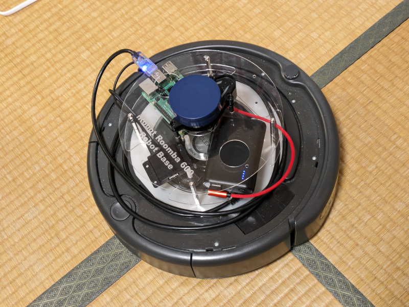
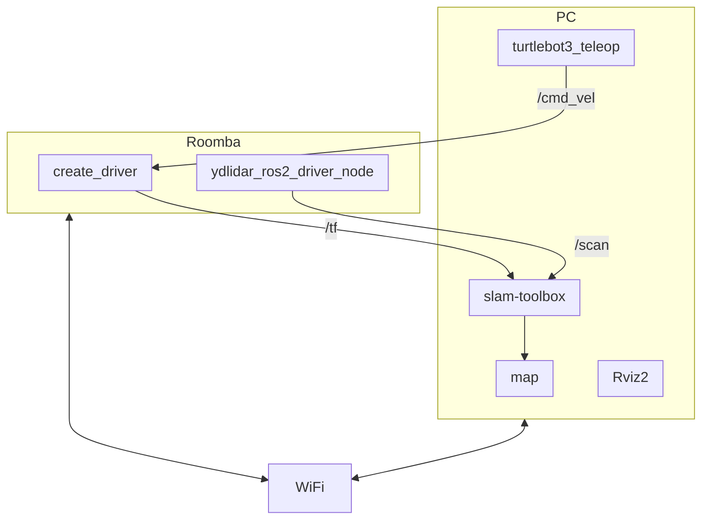
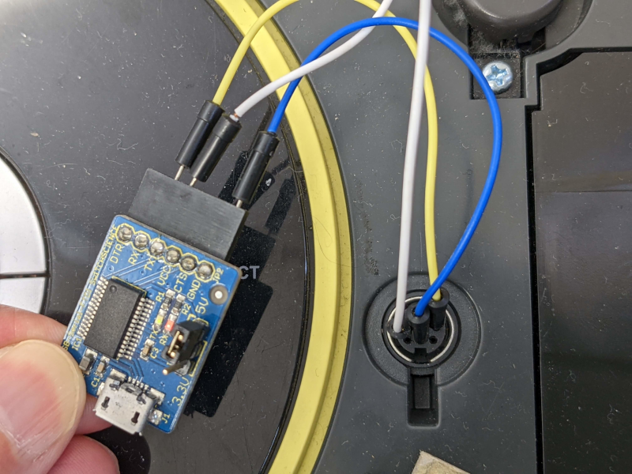
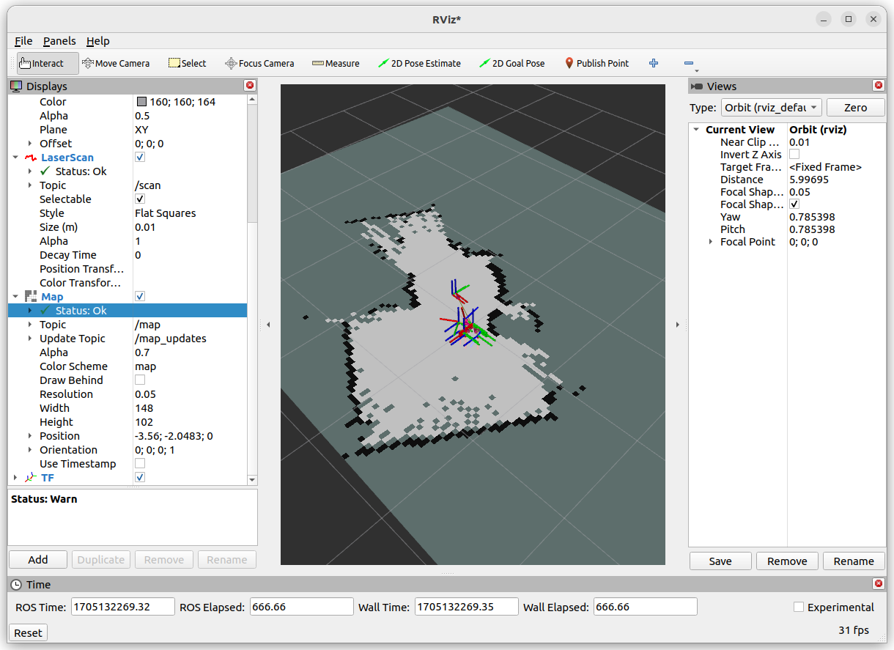
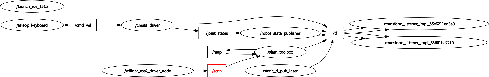
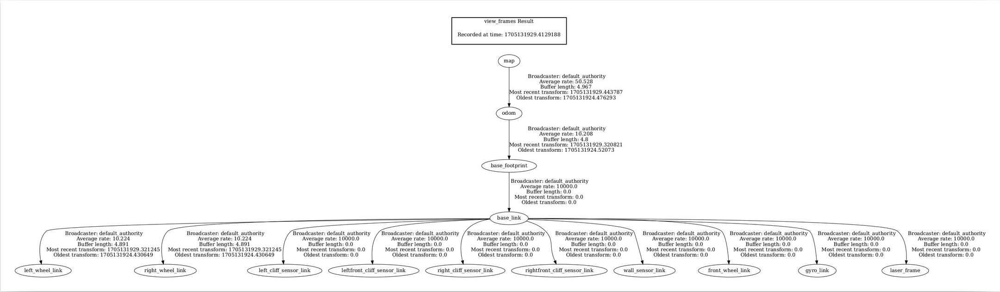

# Roomba実機をROS2 Humbleで動かす環境のセットアップ

 

## 構成図

* SLAM



* Nav2

    TBD

## 必要なもの

* Roomba 500/600/700/800シリーズまたはCreate 1 or Create 2
* Raspberry Pi 4 RAM:4GB
* microSDカード 32GB
* モバイルバッテリ（Raspberry Pi 4が動かせるもの）
* microUSBケーブル（USBシリアル変換ボードとRaspberry PiのUSB-Aの接続用）
* USB-Cケーブル（モバイルバッテリとRaspberry Pi 4の電源USB-Cの接続用）
* USB−シリアル変換ボード（5V）
* ブレッドボード用ワイヤー
* リモートコントロール用のPC（Ubuntuがインストールできるもの。VMWare Playerが使える環境でも良い）
* USBキーボード（Raspberry Pi 4の初期設定に使用）
* microHDMIケーブルとHDMIモニタ（Raspberry Pi 4の初期設定に使用）

## Raspberry Pi 4とRoombaのシリアルポートと接続する方法

Roombaにはシリアルポートが搭載されており、インターフェース仕様が公開されている。このシリアルポートをRaspberry Pi 4に接続することで制御を行うことができる。
* [iRobot® Create® 2 Open Interface (OI) Specification based on the iRobot® Roomba® 600 ](https://edu.irobot.com/learning-library/create-2-oi-spec)

1. RoombaのシリアルポートとUSBシリアルのシリアルポートを以下のように接続する
    ```
    FT232(5V)   Roomba
    GND ------- 6,7 GND
    CTS
    5V
    TXD ------- 3 RXD
    RXD ------- 4 TXD
    RTS
    ```
    ルンバのコネクタを上からみた図
    ```
                      (1) (2)
                       =====
    FT232 TXD <----(3) ===== (4)----> FT232 RXD

                    (5) (6) (7)
                         |
                        GND
    ```
1. 簡易的な接続方法としてRoombaのシリアルポートのコネクタの穴にブレッドボード用のワイヤーを差し込むことで接続できる。 
 


## リモートPCのセットアップ

1. Ubuntu 22.04 LTS Desktopのインストール

    [公式サイト](https://ubuntu.com/download/desktop)からダウンロードしてインストールします。

1. ROS2 humbleのインストール

    便利なインストールスクリプトが公開されていますので、こちらを使います。  
    https://github.com/Tiryoh/ros2_setup_scripts_ubuntu
    ```
    $ git clone https://github.com/Tiryoh/ros2_setup_scripts_ubuntu.git
    $ cd ros2_setup_scripts_ubuntu
    $ ./run.sh
    ```
    ROS2 Humbleのインストールと.bashrcの設定まで行ってくれます。
    
    インストールスクリプトを使わない場合は、[ROS2 Humbleの公式インストールガイド](https://docs.ros.org/en/humble/Installation/Ubuntu-Install-Debians.html)に従ってインストールしてください。
    
1. turtlebot3のパッケージインストール
    ```
    $ sudo apt install ros-foxy-turtlebot3-msgs
    $ sudo apt install ros-foxy-turtlebot3
    ```

1. VMwareの場合は以下の環境変数を~/.bashrcに設定します。(RvizやGazeboがOpenGL2系のため。)
    ```
    export SVGA_VGPU10=0
    ```

## Raspberry Pi 4のセットアップ

### Ubuntu 22.04 LTS Serverのインストール

1. PCでRaspberry pi imager をダウンロードして実行します。
1. インストールするOSはOther general-purpose OSから、Ubuntu Server 22.04.03 LTS (64-bit)を選択して、microSDカードに書き込みます。

### Raspberry Pi 4の環境設定
1. Raspberry pi にHDMIモニタ、USBキーボードを接続し、作成したmicroSDカードをセットして電源を投入する。
1. 立ち上がったらログインする。英語キーボード配列なので注意。
    - 初期アカウントは　ubuntu/ubuntu
    - 初回ログイン時にパスワード変更が入る。
1. WiFiのセットアップを行う。wifis: 以降の記述を追記し、WIFI-SSIDとPASSWORDはWiFi環境に合わせて書き換える。
    ```
    $ sudo vi /etc/netplan/50-cloud-init.yaml
    $ cat 50-cloud-init.yaml
    network:
      ethernets:
        eth0:
          dhcp4: true
          optional: true
      version: 2
      wifis:
        wlan0:
          dhcp4: true
          access-points:
            WIFI-SSID:
              password: PASSWORD
    $ sudo netplan apply
    ```
1. 日本語キーボード対応
    ```
    $ sudo dpkg-reconfigure keyboard-configuration
    ```
    コンソール上にウィザードが表示されるので、以下の順番で選択する
    ```
    Generic 105-key (Intl) PC
    Japanese
    Japanese
    The default for the keyboard layout
    No compose key
    No
    ```
1. 自動更新が行われないように設定を変更します。
    ```
    $ sudo vi /etc/apt/apt.conf.d/S20auto-upgrades
    $ cat S20auto-upgrades
    APT::Periodic::Update-Package-Lists "0";
    APT::Periodic::Unattended-Upgrade "0";
    ```
1. 不要なサービスを停止します。
    ```
    $ systemctl mask systemd-networkd-wait-online.service
    $ sudo systemctl mask sleep.target suspend.target hibernate.target hybrid-sleep.target
    ```
1. IPアドレスを確認して控えておく。
    ```
    $ ip a
    ```
1. ここでrebootしておきます。

### ROS2 humbleのインストール

1. 別のPCから先ほど控えたRaspberry Pi 4のIPアドレスに対してsshで接続する。設定作業はこのリモートPCから行う。
    ```
    $ ssh ubuntu@192.168.100.45
    ```
1. ROS2 humbleのインストール

    リモートPCで行ったようにインストールスクリプトを使用して、ROS2 Humbleをインストールします。
    ```
    $ git clone https://github.com/Tiryoh/ros2_setup_scripts_ubuntu.git
    $ cd ros2_setup_scripts_ubuntu
    $ ./run.sh
    ```
    ROS2 Humbleのインストールと.bashrcの設定まで行ってくれます。
    
    インストールスクリプトを使わない場合は、[ROS2 Humbleの公式インストールガイド](https://docs.ros.org/en/humble/Installation/Ubuntu-Install-Debians.html)に従ってインストールしてください。

### RoombaのROS2ドライバのインストール

1. create_autonomyのインストール

    基本的にはREADME.mdのInstallの手順通りでインストールできます。create_robotはhumble branchを指定します。    
    https://github.com/AutonomyLab/create_robot/tree/humble
    ```
    $ sudo apt install build-essential cmake libboost-system-dev libboost-thread-dev
    $ sudo apt install python3-rosdep python3-colcon-common-extensions
    $ cd ~
    $ mkdir -p create_ws/src
    $ cd create_ws
    $ cd ~/create_ws/src
    $ git clone -b humble https://github.com/autonomylab/create_robot.git
    $ git clone https://github.com/AutonomyLab/libcreate.git
    $ cd ~/create_ws
    $ rosdep update
    $ rosdep install --from-paths src -i
    $ cd ~/create_ws
    $ colcon build --symlink-install
    $ source ~/create_ws/install/setup.bash
    $ sudo usermod -a -G dialout $USER
    ```
    ここで一度ログアウトし、再びログインするとユーザグループ設定が反映されます。

1. ~/.bashrcの設定

    毎回入力するのは大変なので、~/.bashrcを設定しておきます。
    ```
    $ echo 'source ~/create_ws/install/setup.bash' >> ~/.bashrc  
    $ source ~/.bashrc
    ```

### RoombaとRaspberry Pi 4の接続

#### USBデバイスの確認
1. Raspberry Pi 4とUSBシリアルを介してRoombaを接続し、OSで認識されているか確認する。今回は/dev/ttyUSB0で認識したので、以下のように表示された。  
    ```
    $ ls -l /dev/ttyUSB*
    crw-rw---- 1 root dialout 188, 0 May 28 00:28 /dev/ttyUSB0
    ```

#### udevの設定

シリアルUSBデバイスを常に同じデバイス名(/dev/roomba)で読み書きできるように設定する。

1. lsusbコマンドを入力する。
    ```
    $ lsusb
    ```
1. シリアルUSBデバイスのベンダーIDとプロダクトIDをメモする。この例ではシリアルUSBはFT232を使用している。 
    ```
    $ lsusb
    Bus 002 Device 001: ID 1d6b:0003 Linux Foundation 3.0 root hub
    Bus 001 Device 005: ID 046d:c542 Logitech, Inc. 
    Bus 001 Device 004: ID 0403:6001 Future Technology Devices International, Ltd FT232 USB-Serial (UART) IC
    Bus 001 Device 003: ID 3938:1048  
    Bus 001 Device 002: ID 2109:3431 VIA Labs, Inc. Hub
    Bus 001 Device 001: ID 1d6b:0002 Linux Foundation 2.0 root hub
    ```
1. 以下のコマンドを実行する。
    ```
    $ sudo vi /etc/udev/rules.d/77-roomba.rules
    ```
1. 以下のように書き込む。
    ```
    KERNEL=="ttyUSB*", ATTRS{idVendor}=="ベンダーID", ATTRS{idProduct}=="プロダクトID", GROUP="dialout", MODE="0666", SYMLINK+="roomba"
    ```
    設定例
    ```
    KERNEL=="ttyUSB*", ATTRS{idVendor}=="0403", ATTRS{idProduct}=="6001", GROUP="dialout", MODE="0666", SYMLINK+="roomba"
    ```
1. RoombaのUSBシリアルケーブルを一度抜き、再度差し込む。
1. udevの設定が行われ、パーミッションのotherがrwになっていることとroombaのシンボリックリンクができていることを確認する。  
    ```
    $ ls -l /dev/ttyUSB*
    crw-rw-rw- 1 root dialout 188, 0 Jul 31 03:19 /dev/ttyUSB0
    $ ls -l /dev/roomba
    lrwxrwxrwx 1 root root 7 Jul 31 03:19 /dev/roomba -> ttyUSB0
    ```
1. create_robotの設定ファイルを修正する。  
    ~/create_ws/src/create_robot/create_bringup/config/default.yamlのdev:が/dev/ttyUSB0となっているので、/dev/roombaに修正しておく。
    ```
    create_driver:
      ros__parameters:
        # The device path for the robot
        #dev: "/dev/ttyUSB0"
        dev: "/dev/roomba"
               :
    ```

## ルンバを動かす

### Raspberry Piでの動作確認

#### Raspberry Piにログイン

1. Raspberry Piの電源をモバイルバッテリーに接続する。
1. Ubuntu PCからRaspberry Piにログインする。
    ```
    $ ssh ubuntu@192.168.0.63
    ```
    IPアドレスがわからない場合は以下のコマンドで目星を付ける。192.168.0.0/24のところはWiFiのネットワークに合わせてください。
    ```
    $ nmap -sP 192.168.0.0/24
    ```

#### シリアルUSBの接続

1. Raspberry Pi 4とUSBシリアルを接続する。
1. Raspberry Piにログインしているターミナルから、以下のコマンドを入力し、シリアルUSBのデバイスが以下のように表示されることを確認する。  
    ```
    $ ls -l /dev/roomba
    lrwxrwxrwx 1 root root 7 Jul  3 14:57 /dev/roomba -> ttyUSB0
    $ ls -l /dev/ttyUSB0
    crw-rw-rw- 1 root dialout 188, 0 Jul  3 14:45 /dev/ttyUSB0
    ```

#### create_driverノードの起動

1. Roombaの電源を入れる
1. Raspberry Piにログインしているターミナルから、以下のコマンドを入力する。
    ```
    $ ros2 launch create_bringup create_2.launch
    ```
1. 以下のような画面になることを確認する。正常に接続できるとRoombaから音が鳴る。  
    ```
    $ ros2 launch create_bringup create_2.launch
    [INFO] [launch]: All log files can be found below /home/ubuntu/.ros/log/2022-06-25-06-46-02-115705-ubuntu-2665
    [INFO] [launch]: Default logging verbosity is set to INFO
    [INFO] [create_driver-1]: process started with pid [2668]
        :
    [create_driver-1] [INFO] [1656139562.967943352] [create_driver]: [CREATE] "CREATE_2" selected
    [create_driver-1] [INFO] [1656139564.121113068] [create_driver]: [CREATE] Connection established.
    [create_driver-1] [INFO] [1656139564.121519229] [create_driver]: [CREATE] Battery level 30.45 %
    [create_driver-1] [INFO] [1656139564.156253846] [create_driver]: [CREATE] Ready.
    ```

#### ルンバ単体での動作確認

1. 新規にRaspberry Pi 4にログインして、以下のコマンドを入力する。
    ```
    $ ros2 topic pub /cmd_vel geometry_msgs/Twist '{linear: {x: 0.1}, angular: {z: 0.3}}'
    ```
1. ルンバが少しずつ動き続けるのでCTRL-Cで中断する。


### リモートPCでの操作確認

1. ROS2 HumbleをセットアップしたリモートPCにログインする。
1. トピックが流れてきているか確認する。
    ```
    $ ros2 topic list 
    /battery/capacity
    /battery/charge
    /battery/charge_ratio
    /battery/charging_state
    /battery/current
    /battery/temperature
    /battery/voltage
    /bumper
    /check_led
    /clean_button
    /cliff
    /cmd_vel
    /day_button
    /debris_led
    /define_song
    /diagnostics
    /dock
    /dock_button
    /dock_led
    /hour_button
    /ir_omni
    /joint_states
    /main_brush_motor
    /minute_button
    /mode
    /odom
    /parameter_events
    /play_song
    /power_led
    /robot_description
    /rosout
    /scan
    /set_ascii
    /side_brush_motor
    /spot_button
    /spot_led
    /tf
    /tf_static
    /undock
    /vacuum_motor
    /wheeldrop
    /ydlidar_ros2_driver_node/transition_event
    $
    ```

1. ノードの確認

    ```
    $ ros2 node list 
    /create_driver
    /launch_ros_1369
    /robot_state_publisher
    /static_tf_pub_laser
    /ydlidar_ros2_driver_node
    $ 
    ```

1. サービスの確認

    ```
    $ ros2 service list 
    /create_driver/describe_parameters
    /create_driver/get_parameter_types
    /create_driver/get_parameters
    /create_driver/list_parameters
    /create_driver/set_parameters
    /create_driver/set_parameters_atomically
    /launch_ros_1369/describe_parameters
    /launch_ros_1369/get_parameter_types
    /launch_ros_1369/get_parameters
    /launch_ros_1369/list_parameters
    /launch_ros_1369/set_parameters
    /launch_ros_1369/set_parameters_atomically
    /robot_state_publisher/describe_parameters
    /robot_state_publisher/get_parameter_types
    /robot_state_publisher/get_parameters
    /robot_state_publisher/list_parameters
    /robot_state_publisher/set_parameters
    /robot_state_publisher/set_parameters_atomically
    /start_scan
    /static_tf_pub_laser/describe_parameters
    /static_tf_pub_laser/get_parameter_types
    /static_tf_pub_laser/get_parameters
    /static_tf_pub_laser/list_parameters
    /static_tf_pub_laser/set_parameters
    /static_tf_pub_laser/set_parameters_atomically
    /stop_scan
    /ydlidar_ros2_driver_node/change_state
    /ydlidar_ros2_driver_node/describe_parameters
    /ydlidar_ros2_driver_node/get_parameter_types
    /ydlidar_ros2_driver_node/get_parameters
    /ydlidar_ros2_driver_node/list_parameters
    /ydlidar_ros2_driver_node/set_parameters
    /ydlidar_ros2_driver_node/set_parameters_atomically
    $ 
    ```

#### Roombaをキーボードで操作

1. 以下のコマンドを入力する。細かい操作ができるturtlebot3用の操作パッケージを流用する。
    ```
    $ export TURTLEBOT3_MODEL=burger
    $ ros2 run turtlebot3_teleop teleop_keyboard
    ```

## SLAMおよびNav2の動作確認

自律走行を行うためには、LiDARセンサーが必要です。ここでは[YDLiDAR X2](https://www.ydlidar.com/products/view/6.html)を使用した例を示します。  
SLAMやNavigationについては以下を参照してください。

* [Slam Toolbox](https://github.com/SteveMacenski/slam_toolbox)
* [Navigation2](https://navigation.ros.org/)

### LiDARの準備

#### LiDARのROS2ドライバのインストール

YDLiDAR X2の場合の例は以下を参照。その他はLiDARのメーカーサイトを参照してください。  
[/ROS2/instructions/setup-ydlidar-x2-driver.md](/ROS2/instructions/setup-ydlidar-x2-driver.md)


#### LiDARノードの起動

1. 新規にターミナルを立ち上げて、Raspberry PiにログインしてLiDARのドライバを起動する。
    - YDLiDAR X2の場合
        ```
        $ ros2 launch ydlidar_ros2_driver ydlidar_launch.py
        ```
    - SLAMTEC RPLIDAR A1の場合
        ```
        $ ros2 launch sllidar_ros2 sllidar_launch.py serial_port:=/dev/rplidar
        ```
1. 以下のような画面になることを確認する。LiDARが勢いよく回転を始めます。
    ```
    $ ros2 launch ydlidar_ros2_driver ydlidar_launch.py
    [INFO] [launch]: All log files can be found below /home/ubuntu/.ros/log/2022-07-18-23-32-16-832154-ubuntu-1369
    [INFO] [launch]: Default logging verbosity is set to INFO
        :
    [ydlidar_ros2_driver_node-1] YDLidar SDK initializing
    [ydlidar_ros2_driver_node-1] YDLidar SDK has been initialized
    [ydlidar_ros2_driver_node-1] [YDLIDAR]:SDK Version: 1.1.1
    [static_transform_publisher-2] [INFO] [1658187137.609758419] [static_tf_pub_laser]: Spinning until killed publishing transform from 'base_link' to 'laser_frame'
    [ydlidar_ros2_driver_node-1] LiDAR successfully connected
    [ydlidar_ros2_driver_node-1] [YDLIDAR]:Lidar running correctly ! The health status: good
    [ydlidar_ros2_driver_node-1] LiDAR init success, Elapsed time 640 ms
    [ydlidar_ros2_driver_node-1] [CYdLidar] Successed to start scan mode, Elapsed time 1065 ms
    [ydlidar_ros2_driver_node-1] [YDLIDAR] Calc Sample Rate: 3K
    [ydlidar_ros2_driver_node-1] [YDLIDAR] Fixed Size: 720
    [ydlidar_ros2_driver_node-1] [YDLIDAR] Sample Rate: 3K
    [ydlidar_ros2_driver_node-1] [YDLIDAR] Calc Sample Rate: 3K
    [ydlidar_ros2_driver_node-1] [YDLIDAR] Fixed Size: 720
    [ydlidar_ros2_driver_node-1] [YDLIDAR] Sample Rate: 3K
    [ydlidar_ros2_driver_node-1] [YDLIDAR]:Single Fixed Size: 250
    [ydlidar_ros2_driver_node-1] [YDLIDAR]:Sample Rate: 3K
    [ydlidar_ros2_driver_node-1] [YDLIDAR INFO] Single Channel Current Sampling Rate: 3K
    [ydlidar_ros2_driver_node-1] [YDLIDAR INFO] Now YDLIDAR is scanning ......
    ```

## Rviz2での確認

1. Rviz2を起動する。
    ```
    $ rviz2
    ```
1. FileメニューのOpen Configで、[ros2_roomba_slam.rviz](/ROS2/rviz2/ros2_roomba_slam.rviz)を指定します。
1. Global OptionsのFixed Frameをbase_frameにして、ルンバの位置を示すTFデータとLiDARのスキャンデータが見えれば問題ありません。

- configファイルでは以下の点を設定しています。
    - 左側のDisplaysのメニューでAddをクリックする。
    - By display typeからLaserScanを選んでOKをクリックし、追加されたLaserScanのTopicをえらび、Topicに/scanを設定する。TopicのReliabilty PolicyをBest Effortにする。Size(m)を0.03にする。
    - By display typeからMapを選んでOKをクリックし、追加されたmapのTopicをえらび、Topicに/mapを設定する。TopicのReliabilty PolicyをBest Effortにする。
    - By display typeからTFを選んでOKをクリックする。
    - Global OptionsのFixed Frameをodomにする。

## SLAM

1. ルンバをBringupしておきます。
1. 以下のコマンドを入力します。
    ```
    $ ros2 launch slam_toolbox online_async_launch.py
    ```
1. キーボードで操作してmapをつくります。ゆっくり動かすのがコツです。
    ```
    $ export TURTLEBOT3_MODEL=burger
    $ ros2 run turtlebot3_teleop teleop_keyboard
    ```
1. mapができたら以下のコマンドで保存します。
    ```
    $ ros2 run nav2_map_server map_saver_cli -f ~/map
    ```
    まれに保存するときに以下のようなエラーがでることがあります。
    ```
    [ERROR] [1667462998.835674421] [map_saver]: Failed to save the map: timeout
    ```
    この場合は以下のようにタイムアウトが長くなるようにパラメタを追加してください。
    ```
    $ ros2 run nav2_map_server map_saver_cli -f ~/map --ros-args -p save_map_timeout:=10000
    ```
1. Ubuntuのファイルアプリで~/map.pgmをクリックすると作成できたmapが表示されます。

## Nav2

1. ルンバをBringupしておきます。
1. SLAMで作成したmapをホームディレクトリに用意します。
1. Turtlebot3用のNav2パッケージを使用します。
    ```
    $ export TURTLEBOT3_MODEL=burger
    $ ros2 launch turtlebot3_navigation2 navigation2.launch.py use_sim_time:=True map:=$HOME/map.yaml
    ```
1. Rviz2が起動するので、2D Pose Estimateで現在のルンバの位置と向きを設定します。
1. 2D Goal Poseでルンバの目的地と向きを設定します。
1. ルンバが目的地まで走行します。

#### Rviz2が起動したときに、SLAMで作成したmapが表示されない場合  
以下のissueを参考にして、パラメタファイルを修正してください。  
https://github.com/ROBOTIS-GIT/turtlebot3/issues/884  

修正するファイル： /opt/ros/humble/share/turtlebot3_navigation2/param/burger.yaml  
修正前： robot_model_type: "differential"  
修正後： robot_model_type: "nav2_amcl::DifferentialMotionModel"

## 参考資料
### SLAMを実行中の各種画面
* Rviz2
 
* rqt_graph

* ros2 run tf2_tools view_frames

[PDF](images/roomba-view_frames_2024-01-13_16.45.29.pdf)
